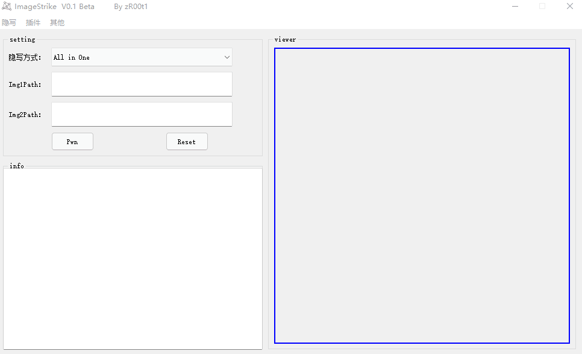
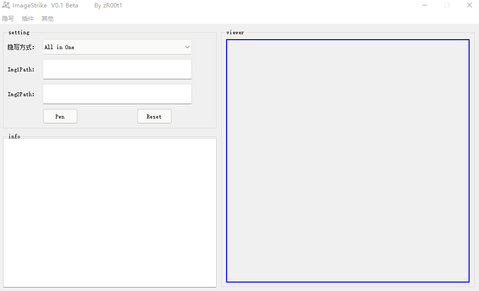

## 🎈简介

ImageStrike是一款使用PyQT5开发，用于CTF中图片隐写的综合利用工具


## 🎗️环境依赖

```
java
```

## 📑文件目录

```
├─imgs								# 图片存储目录
├─tools								# 外部工具存放目录
│   ├─bwm.exe						        # py2打包的盲水印工具
│   ├─Extract.class					        # F5隐写工具
│   └─strings.exe					        # strings可打印字符工具
├─ImageStrike.exe					        # 主程序
├─libiconv.dll						        # pyzbar库dll文件
├─libzbar-64.dll					        # pyzbar库dll文件
└─logo.ico							# 图标
```

## ⚙️运行截图

#### 盲水印：


#### Gif帧分离：


#### 图片反相：


#### PNG自动改宽高：



#### 二维码识别：


#### RGB转图片：



#### Strings可打印字符：


## 🔗参考

[https://github.com/chishaxie/blindwatermark](https://github.com/chishaxie/blindwatermark)

代码大多取自网络资料，在此表示感谢💕

## 🏷️其他

### 已经适配的隐写方法：
- [x] 盲水印
- [x] 二维码识别
- [x] 图片反相
- [x] RGB转图片
- [x] PNG改宽高
- [x] 图片Exif信息
- [x] Gif帧分离
- [x] F5隐写
- [x] Strings可打印字符
### TODO
- [ ] LSB
- [ ] png_idat
- [ ] stegdetect
- [ ] stegbreak
- [ ] zsteg
- [ ] foremost

一些使用其他语言写的隐写工具，python无法做到all in one，如果有师傅可以做到，请联系我加进去，未完待续.....

## 🔊更新日志

【+】   2021.11.13   V0.1Beta
