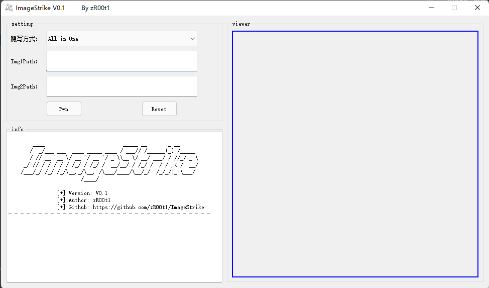

## 🎈简介

ImageStrike是一款使用PyQT5开发，用于CTF中图片隐写的综合利用工具



## 🎗️环境依赖

```
java

stegpy      # pip3 install stegpy
```
[Visual C++ Redistributable Packages for Visual Studio 2013](https://www.microsoft.com/zh-cn/download/confirmation.aspx?id=40784)


## 🔗参考

[https://github.com/chishaxie/blindwatermark](https://github.com/chishaxie/blindwatermark)

[https://github.com/Bronya-Rayi/auto-misc-pic](https://github.com/Bronya-Rayi/auto-misc-pic)

[https://github.com/RetrO-hash/CTFpics](https://github.com/RetrO-hash/CTFpics)

代码大多取自网络资料，在此表示感谢💕

## 🏷️其他

### 已经适配的隐写方法：
- [x] 盲水印
- [x] 二维码识别
- [x] 图片反相
- [x] RGB转图片
- [x] PNG改宽高
- [x] 图片Exif信息
- [x] Gif帧分离
- [x] F5隐写
- [x] Strings可打印字符
- [x] JPG改宽高
- [x] 01二进制转黑白图片
- [x] Stegpy
### TODO
- [ ] LSB
- [ ] png_idat
- [ ] stegdetect
- [ ] stegbreak
- [ ] zsteg
- [ ] foremost

一些使用其他语言写的隐写工具，python无法做到all in one，如果有师傅可以做到，请联系我加进去，未完待续.....


## ⚙️运行截图

#### 盲水印：


#### Gif帧分离：


#### 图片反相：


#### PNG自动改宽高：


#### 二维码识别：


#### RGB转图片：


#### Strings可打印字符：


